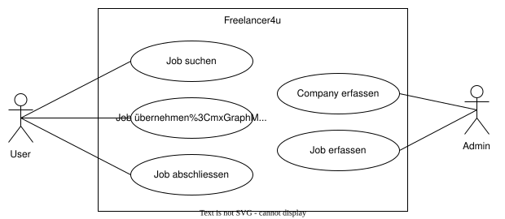

# Freelancer4u

Freelancer4u ist ein vereinfachtes Job-Portal für Freelancer aus dem Bereich Softwareentwicklung.
Es werden zwei Rollen unterschieden:
- **Admin**: Kann Companies und Jobs verwalten.
- **User**: Kann Jobs suchen, übernehmen und abschliessen.

